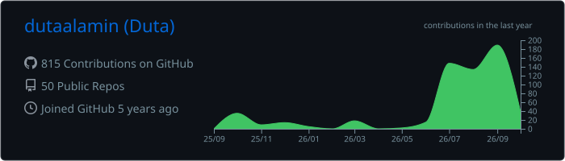
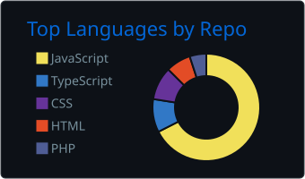
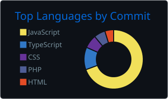
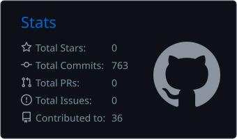
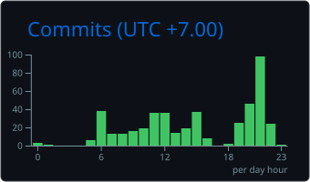

  

<!-- Social icons (self-hosted) -->

  
  &#8287;&#8287;&#8287;&#8287;&#8287;
  
  &#8287;&#8287;&#8287;&#8287;&#8287;
  

 

<!-- Badges (self-hosted) -->

  
  
  

 

 
  
<h2>📊 Stats and Activity</h2>

  <h3>🔥 Streak Stats</h3>
  

    
  

  <h3>💻 Most Used Languages</h3>
  
   

  <b>Note:</b> Top languages is only a metric of the languages my public code consists of and doesn't reflect experience or skill level.

  <h3>📌 Profile Summary</h3>
  
   
  
  
   
  
  

 
  
<h2>📈 Contribution Graph</h2>

  

    <picture>
      <source media="(prefers-color-scheme: dark)" srcset="assets/pacman-dark.svg">
      <source media="(prefers-color-scheme: light)" srcset="assets/pacman-light.svg">
      
    </picture>
  

