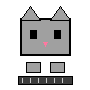
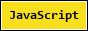
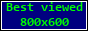
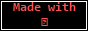

	
	 
	 

**i love code**&nbsp;&nbsp;&nbsp;&nbsp;**and building things on the web**&nbsp;&nbsp;

 

🚧 this profile is **under construction** (forever)

 

check out my latest project: [duta3d](https://github.com/dutaalamin/duta3d) 

 

i write **JavaScript**, **TypeScript**, **PHP** & **Laravel**

and i'm always learning something new 🚀

 

📫 reach me at **dutaalamin23@gmail.com** · [github](https://github.com/dutaalamin)

 
 

     

 

  

 

 
 

best viewed with a CRT monitor at 800×600 · powered by caffeine ☕
